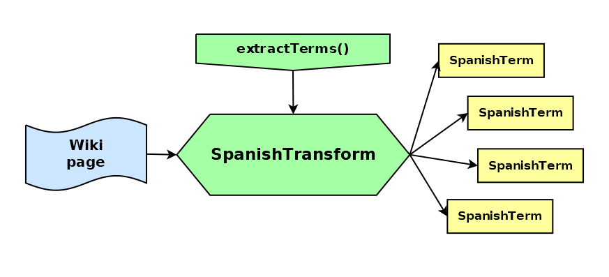

# CervantesJS

_Extract and classify Spanish terms from wiki pages, with TypeScript_


[](https://badge.fury.io/js/@giancosta86%2Fcervantes)
[](/LICENSE)



**CervantesJS** is a _TypeScript_ library for extracting Spanish terms from wiki pages; even more, it is a plugin for [JardineroJS](https://github.com/giancosta86/JardineroJS), creating a SQLite dictionary of Spanish terms by parsing [Wikcionario](https://es.wiktionary.org/).

## Installation

To install the package as a plugin, please refer to the documentation of [JardineroJS](https://github.com/giancosta86/JardineroJS).

> The current version of the plugin requires Jardinero 2.x

Otherwise, to install it as a library reference within a project:

```bash
npm install @giancosta86/cervantes
```

or

```bash
yarn add @giancosta86/cervantes
```

The public API entirely resides in the root package index, so you shouldn't reference specific modules.

## Usage

CervantesJS is firstly and foremostly _a plugin_ for [JardineroJS](https://github.com/giancosta86/JardineroJS): please, consult its documentation for details.

However, you can also reference the package as a **standalone library** for _extracting Spanish terms from wiki pages_!

In this case, you can just import names directly from its root:

```typescript
import {...} from "@giancosta86/cervantes"
```

In particular, you may want to consider:

- the `SpanishTerm` union type - and the related types like `Noun`, `Article`, ...

- `extractTerms()` - to _extract Spanish terms_ from a given wiki page

- `SpanishTransform` - a _transform stream_ applying `extractTerms()` to a flow of wiki pages

- `SPANISH_SQLITE_SCHEMA`: a string containing _the DDL code_ for SQLite

- `createSpanishWritableBuilder()` - creating a `WritableBuilder` (from the [sqlite-writable](https://github.com/giancosta86/sqlite-writable) library) with the required _type registrations_ and with a suitable _transaction capacity_

## Further reference

Please, feel free to explore:

- [JardineroJS](https://github.com/giancosta86/JardineroJS) - the web stack itself, designed for _extensible linguistic analysis_

- [JardineroJS - SDK](https://github.com/giancosta86/JardineroJS-sdk) - the development kit for _creating your own plugins_
